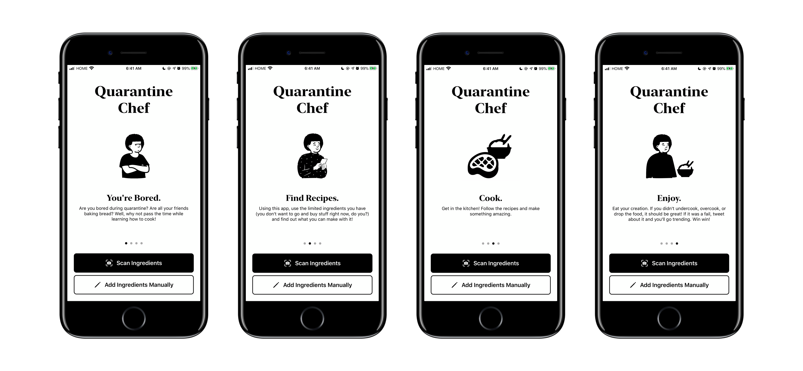
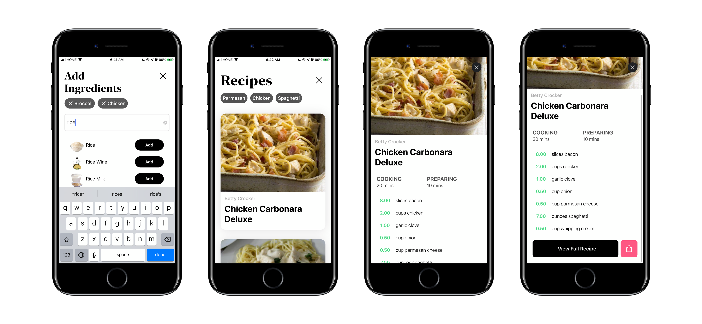

# Quarantine Chef

Using your camera or manual entry, search for ingredients that include the ingredients in your own house.

## Getting Started
To get the app running on your system, install CocoaPods on your machine and run 
```
pod install
```
in the project directory to install any dependencies that may be missing.

**This app requires iOS 13.0 and Xcode 11 to run as the use of iOS 13 SF Symbols are used**

## Dependencies
This project only uses the [Clarifai](https://cocoapods.org/pods/Clarifai) library.

## Art 
Using the amazing [Open Peeps](https://www.openpeeps.com/) library for some of the graphics. 

## Screenshots


