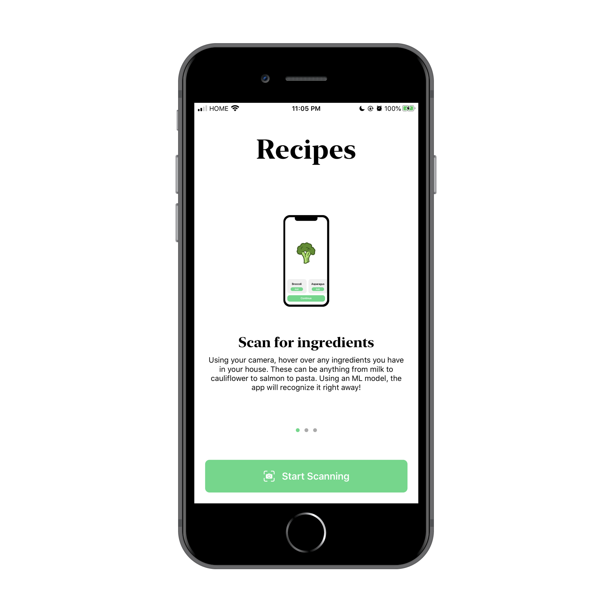
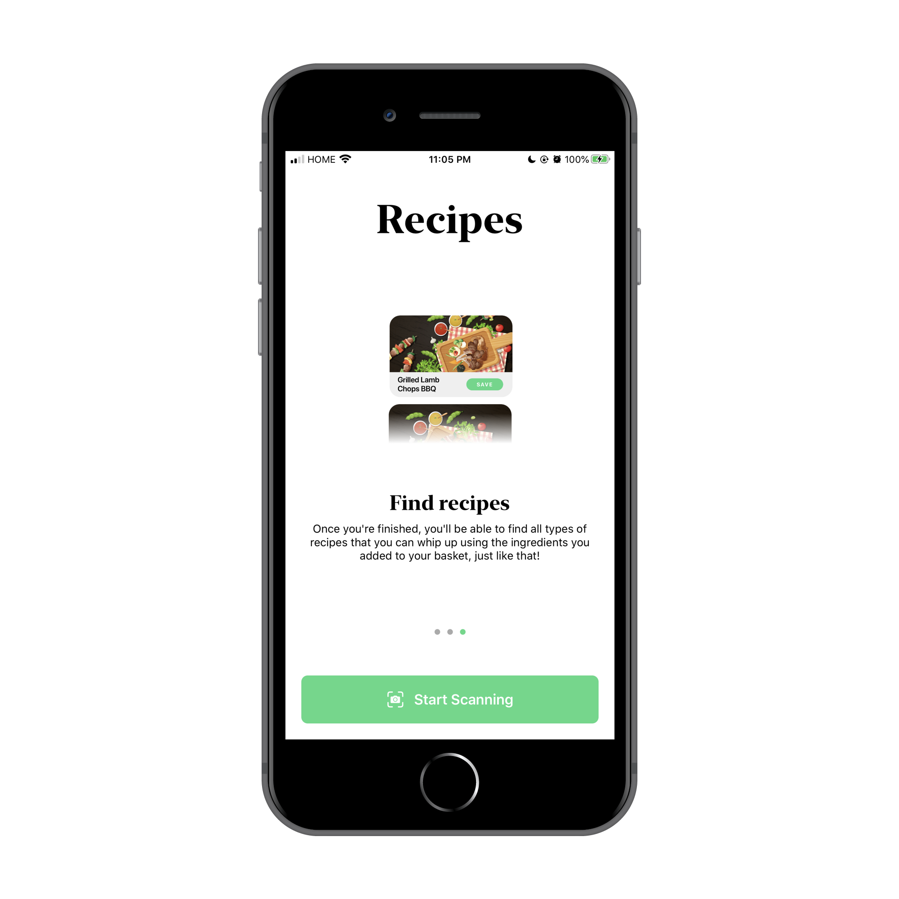
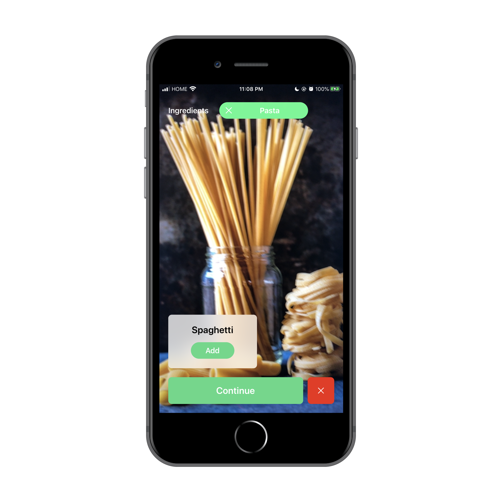
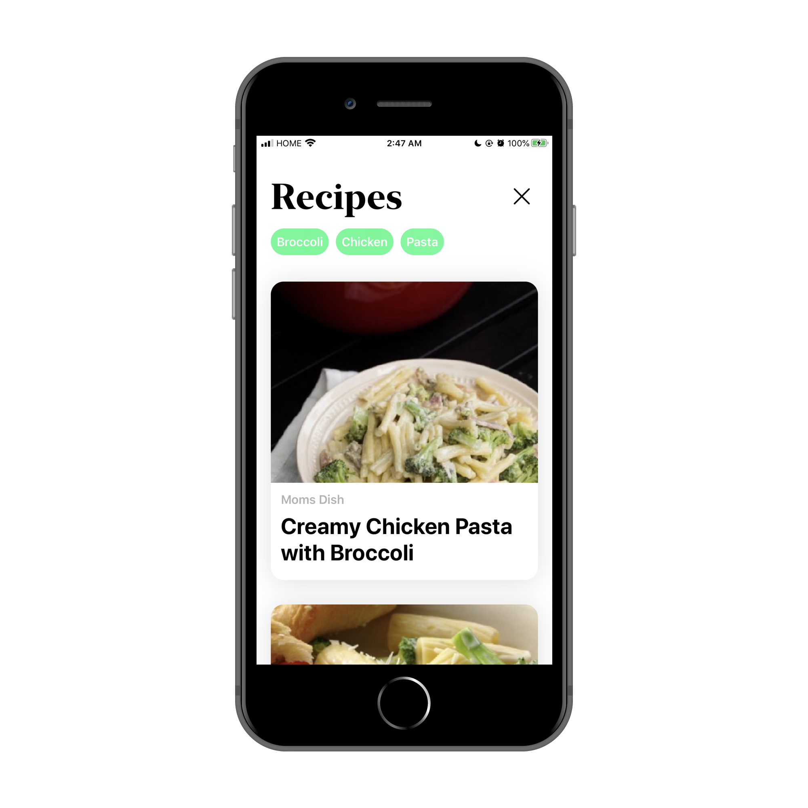
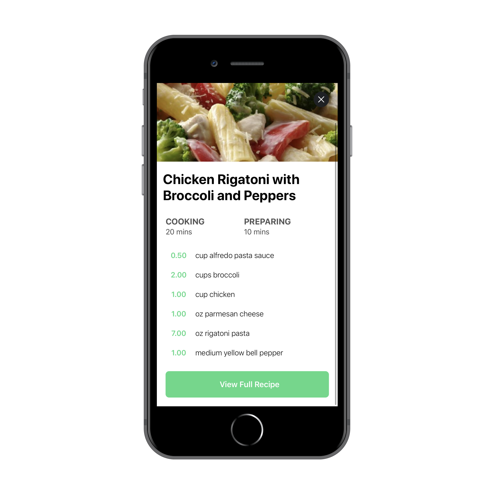

# Recipes-Swift

## Disclaimer 
This app is built on the latest version of Swift (Swift 5) and must be run on iOS 13 to function as intended.

## Story
Because why not:

Basically, entering university, I realized how expensive downtown was going to be especially for food. Instead of getting take out everyday, I decided to learn how to cook for once. For the first two weeks, it was chicken breast and rice, which got boring after a while. In searching up new recipes, I realized that I never have the ingredients that I need, nor do I have the time or money as a student to go on a grocery haul all the time.

Therefore, I have to make do with what I have.

## Screenshots and Demo Video
Find all screenshots and a demo video here: https://drive.google.com/open?id=1KDUkpjlJqEz7NHJqWg585HpfEcoGOjRx

